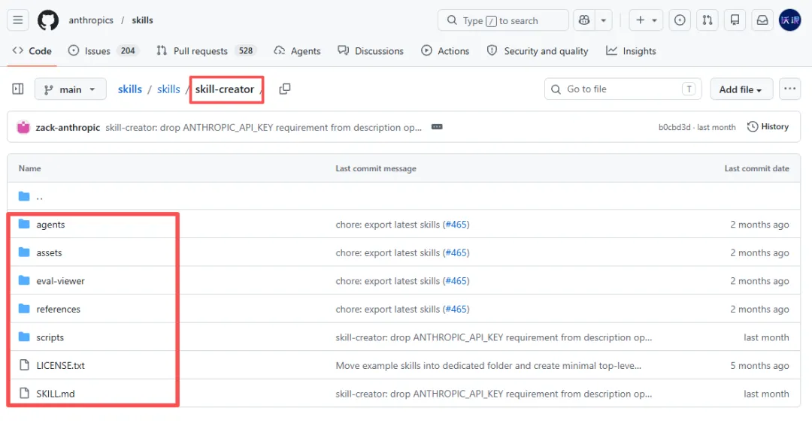
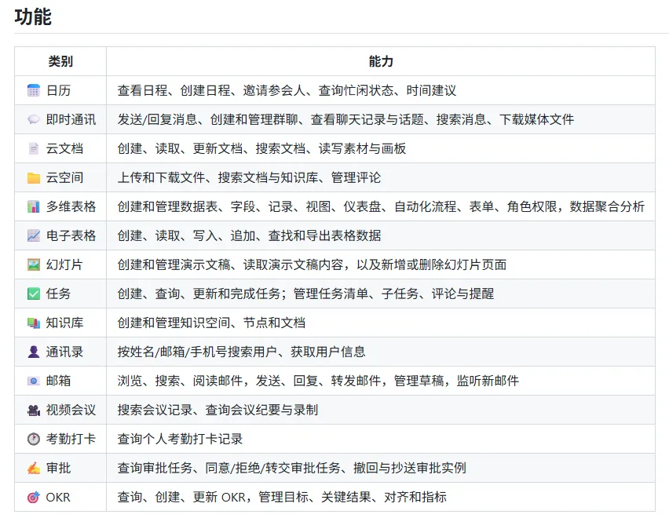

# 最值得安装的 20 个 AI Agent Skills

> **作者**：冷逸 | **来源**：沃垠AI | **发布日期**：2026年4月20日
> **原文**：https://mp.weixin.qq.com/s/uCoIQVuL-X6m0wWd_muAuQ

---


---

## 背景

上期给大家分享了 [Agent Skills 的概念、架构和设计指南](https://mp.weixin.qq.com/s?__biz=MzIwMTU5OTQ1Nw==&mid=2653726379&idx=1&sn=a9278d57b1f41e7835b918004e758f77&scene=21#wechat_redirect)后，很多朋友就在问我，能不能有一些具体的 Skills 推荐？

于是有了今天这篇文章，给大家推荐 20 个精品 Skills。安装极其简单，可以直接把 skill 地址丢给 Claude Code、Codex 或 OpenClaw 这类 Agent，让它来装。

```bash
# 帮我安装这个 Skill：<skills网址>

# ClawHub上的Skill
npx clawhub@latest install skill名称

# GitHub上的Skill
npx skills add skill地址
```

---

## Top 20 推荐 Skills

### 1、skill-creator

这是 Anthropic 官方出品的「元 skill」，专门用于安装 skill，基本上属于必装。在 GitHub 上目前已经有 **80k star**。

> https://github.com/anthropics/skills/tree/main/skills/skill-creator

---

### 2、find-skill

同样是「元 skill」，一个专门寻找 skill 的 skill。安装后，你需要什么 skill，就直接问它。

```bash
npx skills add https://github.com/vercel-labs/skills --skill find-skills
```

> https://skills.sh/vercel-labs/skills/find-skills

---

### 3、Anthropic Skills

除了 skill-creator，Anthropic 共开源了 **17 款 Skills**，其中 office 四件套（docx、pptx、xlsx、pdf）和 webapp-testing、mcp-builder 建议都安装一下。webapp-testing 专门用来做测试，MCP Builder 则主要用来写 MCP 协议。



> https://github.com/anthropics/skills

**注意**：Frontend Design 这个前端设计 skill 设计得比较简陋，不如自己写一个。建议用「界面优化 PUA」提示词来优化前端。

---

### 4、remotion-best-practices

视频生成 skill。只需要给 Claude Code 一句话，它能写出完整的 React 视频脚本，并渲染出 MP4 成片。缺点是工作时间偏长，基本上要 30 分钟甚至 1 小时以上才能出一支片子。

```bash
npx skills add remotion-dev/skills
```

> https://www.remotion.dev

---

### 5、Humanizer-zh

藏师傅出品，一个专门去除 AI 味的 skill，能识别并修复 **24 种 AI 写作痕迹**，比较适合新媒体写作。

> https://github.com/op7418/Humanizer-zh

---

### 6、baoyu-skills

宝玉的内容创作 Skills 合集，非常全面，涵盖公众号、小红书、X 等平台，目前已有 **15k Star**。宝玉老师一直在长期维护这个仓库。

> https://github.com/jimliu/baoyu-skills

---

### 7、knowledge-site-creator

向阳乔木出品，可以一句话生成任何领域的知识型网站。

> https://github.com/joeseesun/qiaomu-knowledge-site-creator

---

### 8、cangjie-skill

好朋友袋鼠帝出品，一个专门用于蒸馏书籍的 skill，可以把任何书籍蒸馏成可复用的 skill。

按照"框架 / 原则 / 案例 / 反例 / 术语"五个维度，把一本书的知识提纯成可执行的 skill。



> https://github.com/kangarooking/cangjie-skill

---

### 9、nuwa-skill

最近很热的**女娲.skill**，来自花叔出品，可以蒸馏任何人的思维，然后用他的认知框架来帮你分析。配套还有一个**达尔文.skill**，女娲造 skill，达尔文让 skill 继续进化。

> https://github.com/alchaincyf/nuwa-skill

---

### 10、ebook-maker-skill

好朋友阿真出品，一个可以写电子书的 skill，可以帮你完成从调研到成书的全流程创作。

> https://github.com/irenerachel/ebook-maker-skill

---

### 11、xiaohu-wechat-format

小互出品，可以用 Claude Code 自动搞定公众号的排版 → 封面（可选）→ 推送。这个 skill 内置了 **30 套主题**，可以根据文本内容自动适配。

> https://github.com/xiaohuailabs/xiaohu-wechat-format

---

### 12、web-access

一泽出品，这个 skill 大大解决了 Claude Code 自身联网能力不够的问题，可以直连本地 Chrome 浏览器，天然带着登录状态，能让 Agent 访问到更多的地方。

> https://github.com/eze-is/web-access

---

### 13、code-review

Anthropic 官方出品，可以帮你审查代码，会从代码质量、安全漏洞、性能问题等多个角度来进行审核。建议在提 PR 前，都先让它审查一遍。

> https://github.com/anthropics/claude-code/tree/main/plugins/code-review

---

### 14、Github

对于开发者，这个是**必装**的 skill。安装后，可以让 Claude Code、OpenClaw 这类 Agent 直连 Github，自动管理 repo、issue、PR、code search 等。

```bash
npx clawhub@latest install github
```

---

### 15、飞书 CLI

飞书重度用户必装技能，安装后可以让 Agent 在终端操作飞书，包括 IM 消息、文档、多维表格、日历、邮箱、任务、会议等业务功能。

> https://github.com/larksuite/cli

---

### 16、chrome-devtools-mcp

严格来说这是 MCP 不是 skill，但强烈建议装上。这个 MCP 内置了 **20 多个工具**，可以完成很多浏览器自动化的事情，比如自动测试、数据抓取等。

> https://github.com/ChromeDevTools/chrome-devtools-mcp

---

### 17、ui-ux-pro-max

这是一个专门设计 UI/UX 的 skill，在 GitHub 上目前已有接近 **70k star**。

> https://github.com/nextlevelbuilder/ui-ux-pro-max-skill

---

### 18、last30days-skill

可以一句话帮你抓取海外 10+ 社区平台（Reddit、X、YouTube、Hacker News、TikTok、Polymarket 等）的真实评论，在 GitHub 上已有 **22k star**。

示例：
```bash
调用 last30days-skill，帮我查询 Trae 在美国市场的反馈。
```

> https://github.com/mvanhorn/last30days-skill

---

### 19、Claude-to-IM-skill

归藏出品，可以把你的 Claude Code 或 Codex 链接 IM 平台，比如飞书、Telegram、Discord、QQ、企微等。不必一直蹲在电脑前，出门也能让 Claude Code 干活。

```bash
npx skills add op7418/Claude-to-IM-skill
```

> https://github.com/op7418/Claude-to-IM-skill

---

### 20、Skill Hub

最后推荐一个 skill 管理器。如果你的 skill 确实太多了（比如超过了 20 种），可以用这个 Skill Hub 来进行可视化管理。

```bash
npm install -g https://github.com/Backtthefuture/huangshu/raw/main/tools/skill-hub/release/claude-skill-hub.tgz && skill-hub
```

> https://github.com/Backtthefuture/huangshu/tree/main/tools/skill-hub

---

## 写在最后

除了以上 20+ Skills 外，你还可以到这几个 skill 市场自由挑选：

- https://skills.sh
- https://www.skillhub.club
- https://clawhub.ai

但更重要的 Skills，还是来自于你**亲手创建**，根据自己的核心工作流创建 5-8 个高频 Skills。

更详细的实操内容见：《[Agent Skills 从入门到精通](https://mp.weixin.qq.com/s?__biz=MzIwMTU5OTQ1Nw==&mid=2653726379&idx=1&sn=a9278d57b1f41e7835b918004e758f77&scene=21#wechat_redirect)》

> 现在，就去创建吧。

---

## 参考资料

- [原文链接](https://mp.weixin.qq.com/s/uCoIQVuL-X6m0wWd_muAuQ)
- [Agent Skills 从入门到精通](https://mp.weixin.qq.com/s?__biz=MzIwMTU5OTQ1Nw==&mid=2653726379&idx=1&sn=a9278d57b1f41e7835b918004e758f77&scene=21#wechat_redirect)
